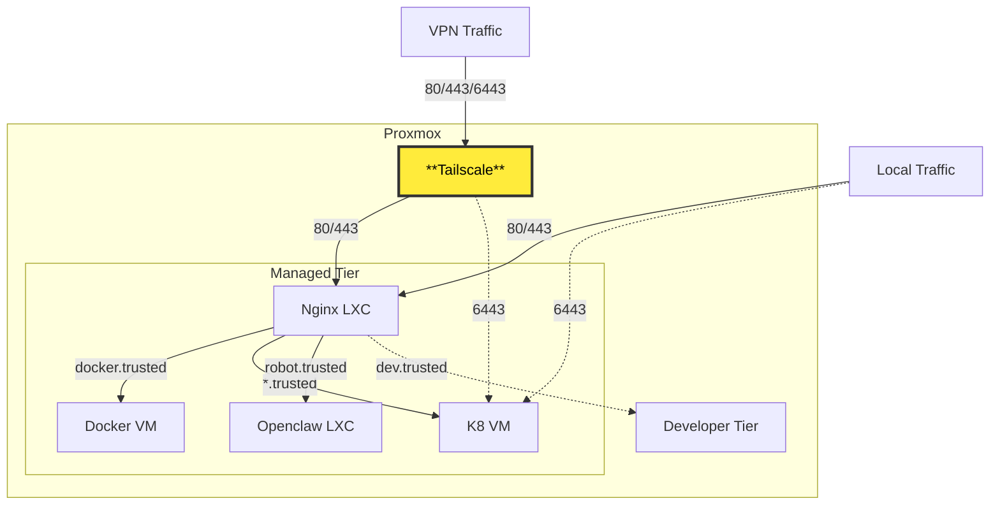

# Operations Center 🚀
 

This repository contains the configurations for my home server, "Operations Center," modeled after professional-grade infrastructure. The goal is to apply modern DevOps practices to a homelab environment.

## 🏗️ Architecture Overview
The system is built on **Proxmox Virtual Environment (PVE)** and follows an **Infrastructure-as-Code (IaC)** and **GitOps** model.

### 🌐 Layers
1. **Virtualization**: **Proxmox VE (milano)** hosts all nodes.
2. **Provisioning**: **Terraform** (`infrastructure/terra/`) manages LXCs and VM resources via the Proxmox provider.
3. **Configuration**: **Ansible** (`infrastructure/ansible/`) handles post-provisioning setup for Docker, Kubernetes nodes, NFS, and Nginx.
4. **Container Orchestration**: **Kubernetes (K3s/K8s)** managed via **FluxCD** (GitOps) in `clusters/managed/`.
5. **Ingress & Networking**: A dedicated **Nginx LXC** (`nginx/`) acts as the primary reverse proxy and entry point for all internal and external services.
6. **Secrets Management**: **Sealed Secrets** (`kubeseal`) allows encrypted secrets to be safely stored in Git.

## 📊 Architecture Visualization

### 📂 Repository Structure
- `/clusters/`: Kubernetes manifests organized by tier (`managed`, `dev`, `live`).
- `/infrastructure/terra/`: Terraform configurations for provisioning hardware resources.
- `/infrastructure/ansible/`: Ansible playbooks, roles, and inventory (`inventory.ini`).
- `/nginx/`: Configuration files for the Nginx LXC proxy.
- `/charts/`: Custom Helm charts for services.
- `/Makefile`: Central hub for operational tasks (encryption, backup, applying infra).

## 📂 Resource Tiers
1. **Managed Tier (`managed`)**: 
   - **Priority**: High. 
   - **Nature**: Production-grade services (SSO, Multimedia, LLMs, Core Networking).
   - **Deployment**: Synchronized via FluxCD.
2. **Development Tier (`dev`)**: 
   - **Priority**: Low. 
   - **Nature**: Experimental playground for testing new services.

## 🛠️ Key Components
- **Monitoring**: Full Prometheus & Grafana stack for observability.
- **Storage**: Mixed storage types including NFS (`vm-mgdnfs`) and CSI drivers.
- **Security**: Authentik for SSO (optional), Sealed Secrets for encryption.

## 🚀 Getting Started
Most operational tasks are managed through the `Makefile`:
- `make terraform-apply`: Provision resources.
- `make ansible-run`: Configure VMs/LXCs.
- `make encrypt FILE=<path>`: Encrypt a `.px.yaml` secret.
- `make nginx-build`: Sync Nginx configurations.
