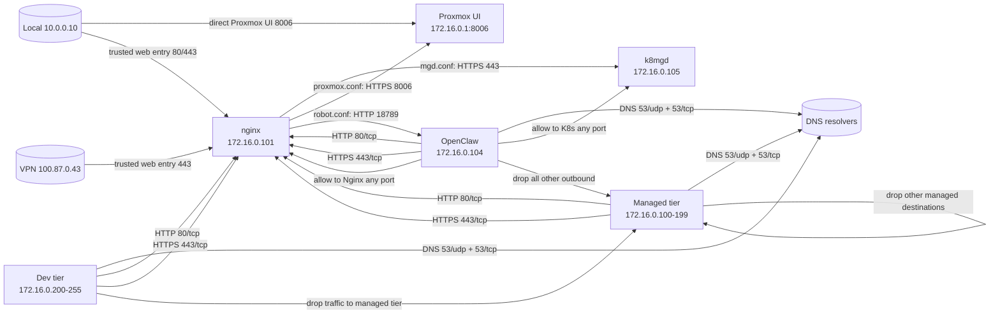

# Proxmox Firewall Rules

This directory defines the current Proxmox firewall policy for the managed and dev tiers, plus the Nginx exceptions needed for the public-facing subdomains.

One important caveat: [`config.tf`](./config.tf) controls whether the Proxmox datacenter firewall is actually enforced. When it is enabled, the rules below become active.

## Traffic Model

## Rule Summary

### `config.tf`
- Datacenter firewall is enabled.
- The node-level `inbound` firewall rule resource exists but is empty.

### `sg-managed`
- Inbound: allow SSH on `22/tcp`.
- Outbound: allow `53/udp`, `53/tcp`, `80/tcp`, and `443/tcp`.
- Outbound: allow Nginx `172.16.0.101` to reach:
  - `172.16.0.105:443` for wildcard `*.trusted.nirmalhk7.com`
  - `172.16.0.1:8006` for `proxmox.trusted.nirmalhk7.com`
  - `172.16.0.104:18789` for `robot.trusted.nirmalhk7.com`
- Outbound: drop traffic to managed IPs and drop all other outbound traffic.
- Order matters: the Nginx exception rules must stay before the managed-subnet DROP or the proxy traffic will never match them.

### `sg-dev`
- Inbound: allow SSH on `22/tcp`.
- Inbound: allow traffic to dev-tier members.
- Outbound: allow `53/udp`, `53/tcp`, `80/tcp`, and `443/tcp`.
- Outbound: drop traffic to managed-tier IPs.

### `lxc-openclaw`
- Inbound: allow SSH on `22/tcp`.
- Inbound: allow `tcp/18789` from `172.16.0.101`.
- Outbound: allow any port to `172.16.0.101` and `172.16.0.105`.
- Outbound: allow `53/udp`, `53/tcp`, `80/tcp`, and `443/tcp`.
- Outbound: drop everything else.

### Guest Attachments
- `lxc-nginx.tf`, `lxc-proxbridge.tf`, `vm-mgdk8.tf`, `vm-mgddocker.tf`, and `vm-mgdnfs.tf` all have `firewall = true` on the network device and attach `sg-managed`.
- `lxc-openclaw.tf` enables its own firewall rules directly and does not rely only on `sg-managed`.
- `vm-mgdk8.tf` has one extra inbound allow for `172.16.0.101:443` so Nginx can reach the backend used by `nginx/conf.d/mgd.conf`.

## Notes

- The managed tier uses `172.16.0.100-199`.
- The dev tier uses `172.16.0.200-255`.
- `nginx/conf.d/mgd.conf` is the wildcard `*.trusted.nirmalhk7.com` route and proxies to `172.16.0.105:443`.
- `nginx/conf.d/proxmox.conf` proxies `proxmox.trusted.nirmalhk7.com` to `172.16.0.1:8006`.
- `nginx/conf.d/robot.conf` proxies `robot.trusted.nirmalhk7.com` to `172.16.0.104:18789`.
- `home.trusted.nirmalhk7.com` uses the wildcard `*.trusted` route in `mgd.conf`, not `local.conf`.
- `nginx/conf.d/local.conf` is a separate local default server on `80`; it is not part of the `*.trusted` routes.
- SSH on `22/tcp` is allowed inbound on every security group shown here.

## Flaws / Caveats

- `ipset-mgd.tf` and `ipset-dev.tf` are commented out, so the Terraform files depend on live Proxmox IP sets with matching names. If those live objects are missing, the `+dc/ipset-*` rules will not behave as intended.
- `sg-dev` currently allows inbound traffic to the dev tier from anywhere. That is broad by design right now, but it means dev is not private.
- `sg-managed` blocks all managed-to-managed traffic except the explicit Nginx exceptions. That is tight and easy to miss when adding a new backend.
- `lxc-openclaw.tf` still allows all outbound ports to `172.16.0.105`. The TODO to narrow that to `tcp/32363` is still unresolved.
- `config.tf` enables the cluster firewall, but the empty `proxmox_virtual_environment_firewall_rules.inbound` block means there is no separate host-level ingress policy defined here.
