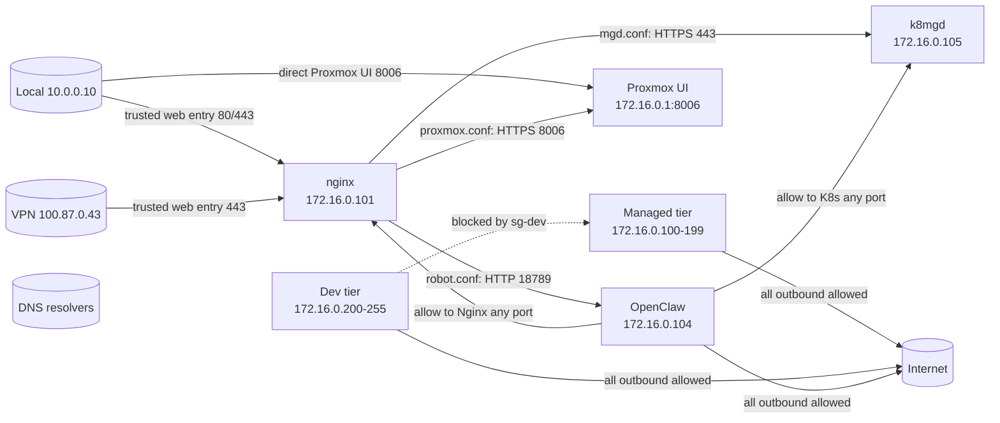

# Proxmox Firewall Rules

This directory defines the current Proxmox firewall policy for the managed and dev tiers, plus the OpenClaw and Nginx exceptions needed for the public-facing subdomains.

[`config.tf`](./config.tf) enables the datacenter firewall and explicitly sets the cluster policies that shape guest forwarding.

## Traffic Model

## Rule Summary

### `config.tf`
- Datacenter firewall is enabled.
- Datacenter input policy is `DROP`.
- Datacenter output policy is `ACCEPT`.
- Datacenter forward policy is `ACCEPT` so bridged guest traffic can leave the host.
- Node firewall is enabled with inbound allows for local LAN, managed bridge, and Tailscale ranges.

### `sg-managed`
- Inbound: allow SSH on `22/tcp`.
- Outbound: allow all traffic.
- Managed guests keep unrestricted egress; the Nginx backend paths now work because they are not blocked by a managed-subnet drop rule.

### `sg-dev`
- Inbound: allow SSH on `22/tcp`.
- Inbound: allow traffic to dev-tier members.
- Outbound: drop traffic from `+dc/ipset-dev` to `+dc/ipset-mgd`.
- Outbound: allow all other traffic.

### `lxc-openclaw`
- Inbound: allow SSH on `22/tcp`.
- Inbound: allow `tcp/18789` from `172.16.0.101`.
- Outbound policy is `ACCEPT`.
- Outbound: explicit allow rules to `172.16.0.101` and `172.16.0.105` remain present but are no longer restrictive because default outbound is open.

### Guest Attachments
- Guest network devices have `firewall = false`; NIC-level firewalling remains disabled because it blocks LXC outbound traffic.
- Managed guest firewall option resources have `enabled = true`, input policy set to `DROP`, and output policy set to `ACCEPT`.
- Managed inbound access is explicit: SSH through `sg-managed`, Nginx `80/tcp`, `443/tcp`, `6901/tcp`, k8mgd `6443/tcp`, Nginx to k8mgd `443/tcp`, and mgdnfs `2049/tcp`, `111/tcp`, `111/udp`.
- `vm-mgdk8.tf` has one extra inbound allow for `172.16.0.101:443` so Nginx can reach the backend used by `nginx/conf.d/mgd.conf`.
- Every guest firewall options resource explicitly sets outbound policy to `ACCEPT`.

## Notes

- The managed tier uses `172.16.0.100-199`.
- The dev tier uses `172.16.0.200-255`.
- `ipset-mgd.tf` and `ipset-dev.tf` define the IP sets referenced by the `+dc/ipset-*` rules.
- `nginx/conf.d/mgd.conf` is the wildcard `*.trusted.nirmalhk7.com` route and proxies to `172.16.0.105:443`.
- `nginx/conf.d/proxmox.conf` proxies `proxmox.trusted.nirmalhk7.com` to `172.16.0.1:8006`.
- `nginx/conf.d/robot.conf` proxies `robot.trusted.nirmalhk7.com` to `172.16.0.104:18789`.
- `home.trusted.nirmalhk7.com` uses the wildcard `*.trusted` route in `mgd.conf`, not `local.conf`.
- `nginx/conf.d/local.conf` is a separate local default server on `80`; it is not part of the `*.trusted` routes.
- SSH on `22/tcp` is allowed inbound on every security group shown here.
