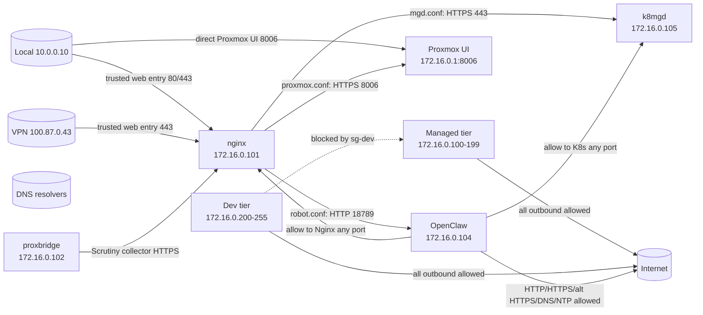

# Proxmox Firewall Rules

This directory defines the current Proxmox firewall policy for the managed and dev tiers, plus the OpenClaw and Nginx exceptions needed for the public-facing subdomains.

[`config.tf`](./config.tf) enables the datacenter firewall and explicitly sets the cluster policies that shape guest forwarding.

## Traffic Model

## Rule Summary

### `config.tf`
- Datacenter firewall is enabled.
- Datacenter input policy is `DROP`.
- Datacenter output policy is `ACCEPT`.
- Datacenter forward policy is `ACCEPT` so bridged guest traffic can leave the host.
- Node firewall is enabled with inbound allows for local LAN, managed bridge, and Tailscale ranges.
- Node firewall drop logging is set to `info` for inbound, outbound, and forwarded traffic.

### `sg-managed`
- Inbound: allow SSH on `22/tcp`.
- Outbound: allow all traffic.
- Managed guests keep unrestricted egress; the Nginx backend paths now work because they are not blocked by a managed-subnet drop rule.

### `lxc-nginx`
- Inbound: allow SSH on `22/tcp` through `sg-managed`.
- Inbound: allow public proxy ports `80/tcp`, `443/tcp`, robot stream proxy `6901/tcp`, and database stream proxy `3306/tcp`, `5432/tcp`, `27017/tcp`.
- Nginx network device has `firewall = true` so its guest firewall rules are enforced.
- Outbound policy remains `ACCEPT`; this preserves certbot DNS-01 renewal, package repository access, and GitHub downloads used by the Nginx Ansible workflow.
- Runtime proxy traffic goes to private backends: `172.16.0.105:443`, `172.16.0.105:31216`, `172.16.0.106:3306`, `172.16.0.106:5432`, `172.16.0.106:27017`, `172.16.0.1:8006`, and `172.16.0.104:18789`.

### `sg-dev`
- Inbound: allow SSH on `22/tcp`.
- Inbound: allow traffic to dev-tier members.
- Outbound: drop traffic from `+dc/ipset-dev` to `+dc/ipset-mgd` and log it at `info`.
- Outbound: allow all other traffic.

### `lxc-openclaw`
- Inbound: allow SSH on `22/tcp`.
- Inbound: allow `tcp/18789` from `172.16.0.101`.
- OpenClaw network device has `firewall = true` so its guest firewall rules are enforced.
- Outbound policy is `DROP`.
- Outbound: allow SSH reply traffic with `tcp/sport 22` so inbound SSH can complete the banner and session after the initial connection.
- Outbound: allow `172.16.0.105:6443`, drop RFC1918 and CGNAT/Tailscale ranges with `info` logging, then allow public `80/tcp`, `443/tcp`, UDP high ports for Discord voice RTP media, alternate HTTPS `2083/tcp` and `8443/tcp`, DNS, and NTP.

### Guest Attachments
- Most guest network devices have `firewall = false`; NIC-level firewalling remains disabled where enabling it previously blocked LXC outbound traffic.
- OpenClaw and Nginx are exceptions: their network devices have `firewall = true` with explicit guest firewall rules.
- Managed guest firewall option resources have `enabled = true`, input policy set to `DROP`, and drop logging set to `info`.
- Managed inbound access is explicit: SSH through `sg-managed`, Nginx `80/tcp`, `443/tcp`, `6901/tcp`, `3306/tcp`, `5432/tcp`, `27017/tcp`, k8mgd `6443/tcp`, Nginx to k8mgd `443/tcp`, and mgdnfs `2049/tcp`, `111/tcp`, `111/udp`, plus ICMP from `172.16.0.105` for reachability checks. The NFS rules are now scoped to `172.16.0.105`.
- `vm-mgdk8.tf` has one extra inbound allow for `172.16.0.101:443` so Nginx can reach the backend used by `nginx/conf.d/mgd.conf`.
- `vm-mgddocker.tf` allows `3306/tcp`, `5432/tcp`, and `27017/tcp` from `172.16.0.101` (nginx stream proxy) and `172.16.0.105` (in-cluster apps) only.
- Most managed guest firewall options resources explicitly set outbound policy to `ACCEPT`; OpenClaw uses `DROP` with explicit outbound allows.

## Notes

- The managed tier uses `172.16.0.100-199`.
- The dev tier uses `172.16.0.200-255`.
- `ipset-mgd.tf` and `ipset-dev.tf` define the IP sets referenced by the `+dc/ipset-*` rules.
- `nginx/conf.d/mgd.conf` is the wildcard `*.trusted.nirmalhk7.com` route and proxies to `172.16.0.105:443`.
- `nginx/conf.d/proxmox.conf` proxies `proxmox.trusted.nirmalhk7.com` to `172.16.0.1:8006`.
- `nginx/conf.d/robot.conf` proxies `robot.trusted.nirmalhk7.com` to `172.16.0.104:18789`.
- `home.trusted.nirmalhk7.com` uses the wildcard `*.trusted` route in `mgd.conf`, not `local.conf`.
- `nginx/conf.d/local.conf` is a separate local default server on `80`; it is not part of the `*.trusted` routes.
- `lxc-proxbridge` (CT 102, `172.16.0.102`) bridges Proxmox host disk SMART telemetry into the cluster. Terraform creates the container only; `infrastructure/ansible/lxc-proxbridge.ansible.yaml` configures disk passthrough and external Scrutiny/Prometheus collectors. The collector resolves `scrutiny.trusted.nirmalhk7.com` to nginx via `/etc/hosts` and posts through `mgd.conf`.
- SSH on `22/tcp` is allowed inbound on every security group shown here.
