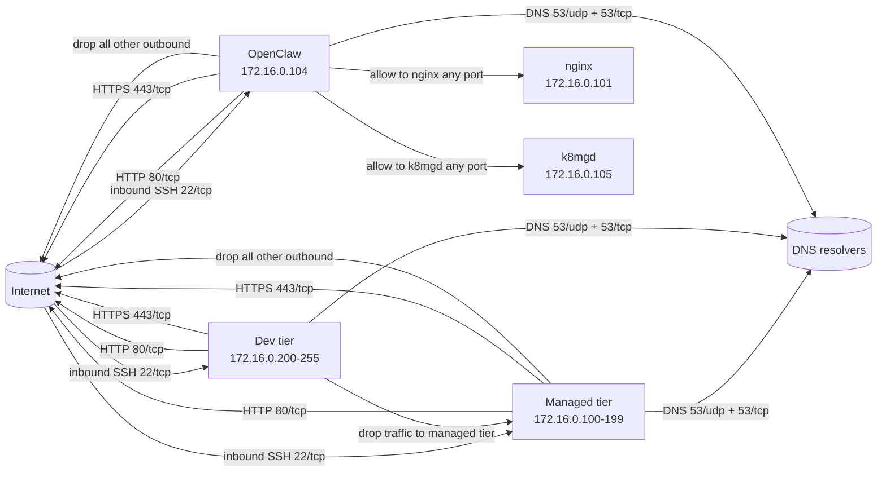

# Proxmox Firewall Rules

This directory defines the intended Proxmox firewall policy for the managed and dev tiers.

One important caveat: [`config.tf`](./config.tf) currently has the datacenter firewall disabled, so these rules are documented as the desired enforcement model. When that switch is enabled, the rules below become active.

## Traffic Model

## Rule Summary

### `sg-managed`
- Inbound: allow SSH on `22/tcp`.
- Outbound: allow `53/udp`, `53/tcp`, `80/tcp`, and `443/tcp`.
- Outbound: drop traffic to other managed IPs and drop all other outbound traffic.

### `sg-dev`
- Inbound: allow SSH on `22/tcp`.
- Inbound: allow traffic to dev-tier members.
- Outbound: allow `53/udp`, `53/tcp`, `80/tcp`, and `443/tcp`.
- Outbound: drop traffic to managed-tier IPs.

### `lxc-openclaw`
- Inbound: allow SSH on `22/tcp`.
- Outbound: allow any port to `172.16.0.101` and `172.16.0.105`.
- Outbound: allow `53/udp`, `53/tcp`, `80/tcp`, and `443/tcp`.
- Outbound: drop everything else.

## Notes

- The managed tier uses `172.16.0.100-199`.
- The dev tier uses `172.16.0.200-255`.
- OpenClaw is intentionally narrower than the shared managed policy.
- The TODO in `lxc-openclaw.tf` tracks tightening the `172.16.0.105` exception to `tcp/32363` if kubectl still works.
